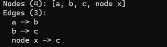

# CSE464Project1
## Features per commits
1. **Feature 1**
   - `parseGraph(filepath)`
   - `toString()`
   - `outputGraph(filepath)`
2. **Feature 2**
   - `addNode(label)`
   - `addNodes(labels[])`
   - duplicate node handling
3. **Feature 3**
   - `addEdge(srcLabel, dstLabel)`
   - duplicate edge handling
4. **Feature 4**
   - `outputDOTGraph(path)`
   - `outputGraphics(path, format)`
To test the code run the following command to build

mvn clean test package

Once the build is successful run the following command

mvn -q exec:java \
  -Dexec.mainClass=edu.asu.cse464.dot.App \
  -Dexec.args="./input.dot ./out"

the example input is

digraph G {
  a -> b;
  b -> c;
  a;
  "node x" -> c;
}

The plain text out put is 

and the image should be
