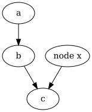

# CSE464Project1
## Features per commits
1. **Feature 1**
   - `parseGraph(filepath)`
   - `toString()`
   - `outputGraph(filepath)`
2. **Feature 2**
   - `addNode(label)`
   - `addNodes(labels[])`
   - duplicate node handling
3. **Feature 3**
   - `addEdge(srcLabel, dstLabel)`
   - duplicate edge handling
4. **Feature 4**
   - `outputDOTGraph(path)`
   - `outputGraphics(path, format)`
# CSE464Project2
## Features per commits
   https://github.com/eavila12/CSE4642026eavila12/commit/1a3b0a67ac619276f7432e7fae8fccf0501d391c
   - `removeNode(String label)`
   - `removeNodes(String[] labels)`
   - `removeEdge(String srcLabel, String dstLabel)`
   # BFS Branch
   https://github.com/eavila12/CSE4642026eavila12/commit/ada613cc19561bd898f98050b3008e98d436d59b
   - `Path GraphSearch(Node src, Node dst)`
   # DFS Branch
   https://github.com/eavila12/CSE4642026eavila12/commit/7e8d62a1785a6ca53ad7d6de386ef0286c02c8be
   - `Path GraphSearch(Node src, Node dst)`
   # Final Merged Main
   https://github.com/eavila12/CSE4642026eavila12/commit/e95d63493e4a6c1aef00df59d3273d9eaa070fd4
   https://github.com/eavila12/CSE4642026eavila12/commit/0e7647ca371394b58be44b70982543747ffdb550
   - `Path GraphSearch(Node src, Node dst, Algorithm algo)`
   # CI
   `GitHub Actions workflow link:` https://github.com/eavila12/CSE4642026eavila12/actions
   `Successful CI run on main:` https://github.com/eavila12/CSE4642026eavila12/actions/runs/23972851873
   `Successful CI run on bfs:` https://github.com/eavila12/CSE4642026eavila12/actions/runs/23972586780
   `Successful CI run on dfs`
   https://github.com/eavila12/CSE4642026eavila12/actions/runs/23968327462
To test the code run the following command to build

mvn clean test package

Once the build is successful run the following command

mvn -q exec:java \
  -Dexec.mainClass=edu.asu.cse464.dot.App \
  -Dexec.args="./input.dot ./out"

the example input is

digraph G {
  a -> b;
  b -> c;
  a;
  "node x" -> c;
}

The plain text out put is 

and the image should be

